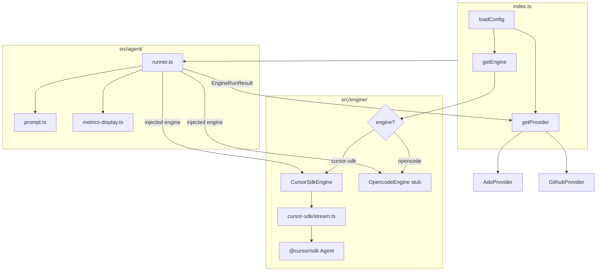

# Refactor: Abstract Execution Engine

## Contexto e motivação

Hoje o acoplamento ao `@cursor/sdk` está todo em `src/agent/stream.ts` (271 linhas). A interface `PlatformProvider` já prova que o padrão "injetar a implementação certa" funciona bem neste codebase — o mesmo padrão se aplica ao engine de execução LLM.

## Nova estrutura de diretórios

```
src/
  engine/
    types.ts                 ← ExecutionEngine + EngineRunResult + EngineRunOptions
    index.ts                 ← getEngine(config) factory
    cursor-sdk/
      engine.ts              ← CursorSdkEngine implements ExecutionEngine
      stream.ts              ← move de src/agent/stream.ts (sem alteração funcional)
      token-usage.ts         ← move de src/agent/token-usage.ts
      model.ts               ← move de src/agent/model.ts
    opencode/
      engine.ts              ← OpencodeEngine stub (Phase 2)
  agent/
    runner.ts                ← recebe ExecutionEngine injetado
    prompt.ts                ← inalterado (agnostic)
    log-prompt.ts            ← inalterado (agnostic)
    metrics-display.ts       ← NOVO: formata Record<string,number> para log
```

## Contratos públicos novos

**`src/engine/types.ts`**

```typescript
export interface EngineRunOptions {
  name: string;
  prompt: string;
  resumeSessionId?: string; // cursor-sdk: agentId; opencode: session id
}

export interface EngineRunResult {
  sessionId: string;          // cursor-sdk: agentId; opencode: session.id
  runId: string;              // cursor-sdk: run.id;  opencode: message.id
  status: string;             // 'completed' | 'cancelled' | 'error'
  fullText: string;
  metrics: Record<string, number>; // well-known keys abaixo
}
// Chaves padronizadas: 'input_tokens', 'output_tokens', 'cache_read_tokens',
// 'cache_write_tokens', 'total_tokens', 'turn_count'

export interface ExecutionEngine {
  readonly engineName: 'cursor-sdk' | 'opencode';
  run(config: ReviewerConfig, options: EngineRunOptions, logger: Logger): Promise<EngineRunResult>;
}
```

## Mapeamento de artefatos cursor-sdk

`CursorSdkEngine.run()` em `src/engine/cursor-sdk/engine.ts` é um adapter fino:
chama `runAgentStream()` (stream.ts intocado) e converte `AgentRunResult.tokenUsage: TokenUsageTotals` → `metrics: Record<string, number>` com as chaves padronizadas acima.

`TokenUsageAccumulator` (importa `InteractionUpdate` de `@cursor/sdk`) fica em `cursor-sdk/token-usage.ts`. O tipo `TokenUsageTotals` passa a ser interno ao módulo cursor-sdk.

## Migração de `emitPipelineReviewOutput`

`PlatformProvider.emitPipelineReviewOutput` hoje aceita `tokenUsage?: TokenUsageTotals`. Troca para `metrics?: Record<string, number>`. Os dois providers (`AdoProvider`, `GithubProvider`) e `pipeline-logging.ts` usam o novo helper `formatEngineMetrics(metrics)` de `src/agent/metrics-display.ts`.

## Factory e config

- `CURSOR_REVIEWER_ENGINE=cursor-sdk` (default) adicionado ao `.env.example`
- `ReviewerConfig` ganha campo `engine: 'cursor-sdk' | 'opencode'`
- `src/engine/index.ts` exporta `getEngine(config): ExecutionEngine`

## `src/agent/runner.ts` atualizado

```typescript
export async function runCodeReviewAgent(
  config: ReviewerConfig,
  context: PromptContext,
  engine: ExecutionEngine,       // ← injetado, não resolvido aqui
  logger: Logger,
): Promise<EngineRunResult> {
  const prompt = buildAgentPrompt(config, context);
  logger.info('Setting sources: project (harness do repositório)');
  return engine.run(config, { name: `${config.projectName} Cursor Reviewer`, prompt }, logger);
}
```

## `src/index.ts` — bootstrap atualizado

```typescript
const engine = getEngine(config);          // ← nova linha
// ...
const result = await runCodeReviewAgent(config, context, engine, logger);
provider.emitPipelineReviewOutput(gate, reviews, config.dryRun, result.metrics, logger.info);
```

## OpencodeEngine — Fase 1 (stub) e Blueprint Fase 2

### Fase 1 — stub em `src/engine/opencode/engine.ts`

```typescript
export class OpencodeEngine implements ExecutionEngine {
  readonly engineName = 'opencode' as const;
  async run(_config: ReviewerConfig, _options: EngineRunOptions, _logger: Logger): Promise<EngineRunResult> {
    throw new Error('OpencodeEngine: not yet implemented. Set CURSOR_REVIEWER_ENGINE=cursor-sdk.');
  }
}
```

### Fase 2 — Blueprint de implementação real

A SDK `@opencode-ai/sdk` (v1.17+) expõe:

**1. Lifecycle do servidor**
```typescript
// Sobe servidor local + cliente em uma chamada
const { client, server } = await createOpencode({
  hostname: '127.0.0.1',
  port: 4096,
  config: { model: resolvedModel },  // formato: 'anthropic/claude-3-5-sonnet-20241022'
});
// ... execução ...
server.close(); // sempre no finally
```

**2. Model mapping** — `config.model` já usa o formato `provider/model` do opencode:
```typescript
const [providerID, ...rest] = config.model.split('/');
const modelID = rest.join('/'); // ex: 'claude-3-5-sonnet-20241022'
```

**3. Session workflow**
```typescript
const session = await client.session.create({ body: { title: options.name } });
const sessionId = session.data.id;

// Injetar system prompt sem disparar resposta (noReply)
await client.session.prompt({
  path: { id: sessionId },
  body: { noReply: true, parts: [{ type: 'text', text: systemContext }] },
});

// Enviar prompt principal — retorna AssistantMessage com fullText
const result = await client.session.prompt({
  path: { id: sessionId },
  body: {
    model: { providerID, modelID },
    parts: [{ type: 'text', text: options.prompt }],
  },
});

await client.session.delete({ path: { id: sessionId } }); // cleanup
```

**4. Structured Output (oportunidade Fase 2)** — opencode suporta JSON schema nativo:
```typescript
body: {
  format: { type: 'json_schema', schema: reviewOutputSchema, retryCount: 2 },
  parts: [{ type: 'text', text: options.prompt }],
}
// result.data.info.structured_output → JSON validado pelo engine, sem parsing frágil
```
Isso elimina a necessidade do `parser/review-response.ts` para este engine — decisão a tomar na Fase 2.

**5. Event streaming** (alternativa ao prompt síncrono para logs em tempo real):
```typescript
const events = await client.event.subscribe();
for await (const event of events.stream) {
  logger.debug(`[opencode] ${event.type}`, event.properties);
}
```

**6. Métricas** — opencode não expõe token counts via SDK hoje; `metrics` será `{}` inicialmente, evoluindo conforme a API expande.

**7. `resumeSessionId`** — mapeado diretamente para `session.get({ path: { id } })` antes de fazer `session.prompt`, reutilizando sessão existente (equivalente ao `Agent.resume` do cursor-sdk).

## Diagrama de fluxo pós-refactor



## Impacto em testes

- `test/model.test.ts`, `test/token-usage.test.ts` — atualizar import paths
- `test/config.test.ts` — adicionar caso para `CURSOR_REVIEWER_ENGINE`
- `src/seed/run-seed-test.ts` — injetar `getEngine(config)` na chamada de `runCodeReviewAgent`
- Todos os outros testes: zero impacto (sem mudança de comportamento)

## Docs a sincronizar

- `AGENTS.md` — tabela de arquitetura (adicionar `src/engine/`)
- `README.md` — documentar `CURSOR_REVIEWER_ENGINE`
- `.env.example` — adicionar a variável

## O que NÃO muda

- Todo `src/ado/`, `src/git/`, `src/parser/`, `src/project/`, `src/provider/` — sem alterações funcionais
- `PlatformProvider` interface: apenas a assinatura de `emitPipelineReviewOutput`
- Comportamento de runtime: cursor-sdk continua como padrão, zero regressão
