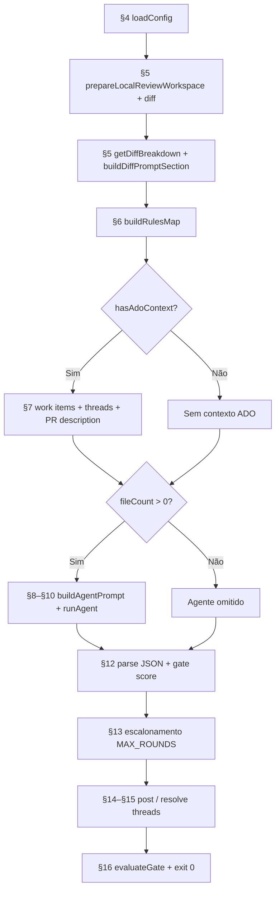

# FAQ — Cursor Reviewer

> **Formato:** cada item usa **pergunta** (`### …?`) + **Resposta** + *Evidência* quando aplicável.  
> **Ordem:** sequência de execução do runner (`src/index.ts`).  
> **Complementa:** [`flow-analysis.md`](flow-analysis.md) · [`score_calc.md`](score_calc.md) · [`../README.md`](../README.md)

---

## Índice rápido *(ordem de execução)*

| # | Seção | Momento no runner |
|---|--------|-------------------|
| 1 | [Visão geral](#1-visão-geral) | — |
| 2 | [O que faz e não faz](#2-o-que-o-reviewer-faz-e-não-faz) | — |
| 3 | [Linha do tempo](#3-linha-do-tempo-ordem-de-execução) | Mapa completo |
| 4 | [Configuração](#4-configuração-e-pré-requisitos) | `loadConfig` |
| 5 | [Git, diff e arquivos](#5-git-diff-e-seleção-de-arquivos) | `prepareLocalReviewWorkspace` |
| 6 | [Rules pré-mapeadas](#6-rules-pré-mapeadas) | `buildRulesMap` |
| 7 | [**User Story, Task e contexto ADO**](#7-user-story-task-e-contexto-ado) | `getPullRequestWorkItemContext` + PR + threads |
| 8 | [Montagem do prompt](#8-montagem-do-prompt-system_prompt-vs-runtime) | `buildAgentPrompt` |
| 9 | [Agente Cursor SDK](#9-agente-cursor-sdk) | `runCodeReviewAgent` |
| 10 | [Análise em duas fases](#10-análise-em-duas-fases) | Dentro do agente |
| 11 | [Score e severidade](#11-score-severidade-e-o-que-vira-thread) | Classificação no agente |
| 12 | [JSON e parser](#12-resposta-json-e-parser) | `parseCodeReviewResponse` |
| 13 | [Escalonamento de rodadas](#13-orçamento-de-rodadas-e-escalonamento) | `round-state` (pré-publicação) |
| 14 | [Publicação no ADO](#14-publicação-no-azure-devops) | `post-comments` |
| 15 | [Threads, dedup e resolução](#15-threads-dedup-e-resolução) | `review-context` |
| 16 | [Pipeline e exit codes](#16-pipeline-ci-e-códigos-de-saída) | `gate` |
| 17 | [Troubleshooting](#17-troubleshooting) | — |
| 18 | [Mapa de evidências](#18-mapa-de-evidências-no-código) | — |

---

## 1. Visão geral

### O que é o Cursor Reviewer?

**Resposta:** Revisor automatizado de Pull Requests para Azure DevOps via [**Cursor SDK**](https://cursor.com/docs/sdk/typescript) em modo **agêntico**. Aplica regras do projeto (`AGENTS.md`, `.cursor/rules/`, skill `code-review`) e **publica threads** na PR. **Não altera código.**

*Evidência:* `README.md`; `src/index.ts`.

### Quem decide se um achado é válido?

**Resposta:** Duas camadas — (1) **agente LLM:** triagem, investigação, score, JSON; (2) **TypeScript:** gate score `SCORE_MIN`–10 (default 6–10), campos obrigatórios, dedup (`review-validation.ts`, `post-comments.ts`).

*Evidência:* `docs/flow-analysis.md`; `parseCodeReviewResponse`.

### O review bloqueia o merge?

**Resposta:** **Não por padrão.** Exit **0** mesmo com threads pendentes. Exit **1** só em erro fatal (config, ADO, agente).

*Evidência:* `src/index.ts`; `README.md`.

---

## 2. O que o reviewer faz e não faz

### O que o reviewer faz?

**Resposta:** (1) Prepara git e diff; (2) filtra `.cs`/`.ts`/`.html`; (3) coleta work items e threads ADO; (4) executa agente em duas fases; (5) parseia JSON e aplica gate; (6) publica/resolve threads; (7) emite resumo COM/SEM ISSUES.

*Evidência:* módulos listados em `src/index.ts` (ver [§3](#3-linha-do-tempo-ordem-de-execução)).

### O que o reviewer **não** faz?

**Resposta:** Não faz auto-fix, commit ou push; não resolve thread só porque a linha sumiu do diff; não publica nits abaixo de `SCORE_MIN` (default: score &lt; 6); não bloqueia a pipeline; não trata threads de humanos/outros bots como pendentes do bot.

*Evidência:* `README.md`; `skills/SYSTEM_PROMPT.md`.

---

## 3. Linha do tempo (ordem de execução)

### Qual a ordem de execução do runner?

**Resposta:** Ver diagrama e tabela abaixo — cada linha aponta para a seção FAQ correspondente.



| Etapa | Seção FAQ | O que acontece | Arquivo |
|-------|-----------|----------------|---------|
| 1 | [§4](#4-configuração-e-pré-requisitos) | Carrega env, CLI, vars ADO, valida modelo | `src/config.ts` |
| 2 | [§5](#5-git-diff-e-seleção-de-arquivos) | Checkout/fetch; diff `target...HEAD` | `src/git/diff.ts` |
| 3 | [§5](#5-git-diff-e-seleção-de-arquivos) | Filtra `.cs`/`.ts`/`.html`; embute diff (~100 KB) | `getDiffBreakdown`, `diff-prompt.ts` |
| 4 | [§6](#6-rules-pré-mapeadas) | Pré-mapeia `.cursor/rules/*.mdc` | `src/project/rules-map.ts` |
| 5 | [**§7**](#7-user-story-task-e-contexto-ado) | **Work items (US/Task), descrição PR, threads** | `work-items.ts`, `pull-request.ts`, `review-context.ts` |
| 6 | [§8](#8-montagem-do-prompt-system_prompt-vs-runtime) | Monta prompt único e chama agente | `src/agent/prompt.ts` |
| 7 | [§9–§10](#9-agente-cursor-sdk) | Agente executa Fase 1 + Fase 2 | `runner.ts`, `stream.ts` |
| 8 | [§12](#12-resposta-json-e-parser) | Extrai JSON; filtra score ≥ SCORE_MIN (default 6) | `parser/`, `post-comments.ts` |
| 9 | [§13](#13-orçamento-de-rodadas-e-escalonamento) | Escalonamento (opcional) | `round-state.ts` |
| 10 | [§14](#14-publicação-no-azure-devops) | Resolve threads → posta novas → summary | `post-comments.ts` |
| 11 | [§16](#16-pipeline-ci-e-códigos-de-saída) | Resumo COM/SEM ISSUES | `gate.ts` |

*Evidência:* `src/index.ts` (~158–222) — diff vazio + ADO válido omite etapas 6–7; 8–11 ainda rodam.

### O que acontece se o diff estiver vazio mas houver contexto ADO?

**Resposta:** O agente é **omitido**; o gate ainda avalia threads pendentes do bot.

*Evidência:* `src/index.ts`.

---

## 4. Configuração e pré-requisitos

### O que posso editar no runner?

**Resposta:** `skills/SYSTEM_PROMPT.md` (contrato JSON, read-only — **sem** US/Task) e `skills/CODE_REVIEW.md` (roteamento ao harness). Critérios de negócio ficam no repo analisado (`.agents/skills/code-review/`, `.cursor/rules/`, `docs/`). Referência local: `.env.example`.

*Evidência:* `src/config.ts`; `README.md`.

### Como configurar o modelo LLM?

**Resposta:** Prioridade: (1) CLI `--model <id>`; (2) env `CURSOR_REVIEWER_MODEL`; (3) default `composer-2.5`. Validado contra enum em `src/agent/model.ts` — ID inválido → exit 1. Macro ADO não expandida → default. Azure Pipelines: variable group + `azure-pipelines-cursor-code-review.yml`.

*Evidência:* `src/config.ts`; `src/agent/stream.ts`; `src/agent/model.ts`.

### O que é obrigatório para rodar?

**Resposta:** Sempre `CURSOR_API_KEY`. PAT/OAuth só se precisar de ADO (US/Task, threads, publicação).

### Preciso de PAT local?

**Resposta:** Só para contexto ADO ou publicação real. Dry-run básico: só API key. Ver [§7](#7-user-story-task-e-contexto-ado).

### Qual a diferença entre dry-run e publicação real?

**Resposta:** `--dry-run`: analisa e loga preview; **sem POST** no ADO. Publicação real: org + project + repo + pr-id + token.

### Quais variáveis de ambiente são mais usadas?

**Resposta:** `CURSOR_API_KEY` (obrig.), `CURSOR_REVIEWER_MODEL`, `AZURE_DEVOPS_EXT_PAT`, `CURSOR_REVIEWER_TARGET_BRANCH`, `CURSOR_REVIEWER_MAX_ROUNDS` (default 5), `CURSOR_REVIEWER_TIMEOUT_MS`, `CURSOR_REVIEWER_REPO_ROOT`, `CURSOR_REVIEWER_STACK` (seleção de stack). Lista completa: [`../README.md`](../README.md).

*Evidência:* `src/config.ts`; `test/config.test.ts`.

### Como funciona a seleção de Stacks Tecnológicas?

**Resposta:** Permite focar o review em determinadas extensões de arquivos e carregar recomendações de arquitetura/segurança adequadas. É configurada explicitamente via flag CLI `--stack` ou env `CURSOR_REVIEWER_STACK`. Se a stack informada for desconhecida, ocorre um erro fail-fast. Caso a variável contiver uma macro não-expandida do ADO (como `$(CURSOR_REVIEWER_STACK)`), o runner resolve automaticamente para o default. Se nenhuma stack ou env for informada, o runner tentará autodetectar a stack do projeto.

*Evidência:* `src/config.ts`; `test/config.test.ts`.

### Como funciona a estratégia de autodetecção automática da stack?

**Resposta:** O runner inspeciona a raiz do repositório (`repoRoot`) procurando por arquivos específicos ou pacotes declarados no `package.json`:
1.  **PHP/Laravel:** Presença do arquivo `artisan` ou `composer.json`.
2.  **Next.js/React:** Presença de arquivos de configuração como `next.config.js`/`next.config.mjs`/`next.config.ts`, ou o pacote `next` nas dependências do `package.json`.
3.  **ABP/Angular:** Presença de arquivos `angular.json`, diretório `angular/` ou dependência `@angular/core` no `package.json`.
4.  **TypeScript:** Presença de `tsconfig.json` ou pacote `typescript`/`tsx` no `package.json`.
5.  **C#/.NET (ABP/Angular):** Presença de arquivos com extensões `.sln` ou `.csproj`.

Caso nenhuma das heurísticas acima identifique uma stack, o runner assume a stack padrão `ABP/Angular` como fallback. O log da inicialização indica explicitamente qual stack foi ativada e de onde veio sua definição (`configurada via CLI`, `configurada via env`, `autodetectada` ou `fallback padrão`).

*Evidência:* `src/config.ts`; `src/index.ts`; `test/config.test.ts`.

### Quais stacks são suportadas por padrão e o que elas filtram?

**Resposta:**
- **ABP/Angular** (Padrão): Filtra `.cs`, `.ts`, `.html` (mantendo 100% de compatibilidade).
- **PHP/Laravel**: Filtra `.php`, `.js`, `.ts`, `.vue`, `.html`, `.css`, `.json`.
- **Next.js/React**: Filtra `.ts`, `.tsx`, `.js`, `.jsx`, `.html`, `.css`, `.json`.
- **TypeScript**: Filtra `.ts`, `.json`.

*Evidência:* `src/config.ts`.

### Como a stack se comporta em execuções de testes E2E (`--seed-test`)?

**Resposta:** Quando a flag `--seed-test` é fornecida, o runner ignora qualquer valor de stack configurado por env var e força a stack para `ABP/Angular`. Isso impede que fixtures C# e Angular de validação sejam filtradas e causem falhas nos testes locais.

*Evidência:* `src/config.ts`; `test/config.test.ts`.

### Como os arquivos de recomendação por stack são embutidos?

**Resposta:** Durante a montagem do prompt, o runner busca o arquivo de recomendações estáticas em `skills/stacks/<nome-da-stack>.md` (como `typescript.md` ou `php-laravel.md`) e anexa seu conteúdo na seção `# Recomendações Específicas da Stack (<nome>)` no prompt final do agente.

*Evidência:* `src/agent/prompt.ts`; `test/prompt.test.ts`.

---

## 5. Git, diff e seleção de arquivos

### Qual diff é usado?

**Resposta:** Local: `{targetRef}...HEAD`. CI: `origin/{target}...origin/{source}` após fetch. Com `--include-uncommitted`: acrescenta working tree vs `HEAD`.

*Evidência:* `src/git/diff.ts`.

### Quais arquivos entram no review?

**Resposta:** Include: `**/*.cs`, `**/*.ts`, `**/*.html`. Exclude: proxies, bin/obj, `.md`, `.csproj`, `scripts/cursor-reviewer/**` (anti self-review). Só arquivos **AMR** no diff.

*Evidência:* `src/config.ts`; `src/git/diff.ts`.

### Como o diff entra no prompt?

**Resposta:** `buildDiffPromptSection` — até **100 KB** embutido (`full` ou `per-file`); acima disso o agente complementa via tools.

*Evidência:* `src/git/diff-prompt.ts` — `MAX_DIFF_PROMPT_BYTES = 100_000`.

### Qual a diferença entre modo local e CI?

**Resposta:** Local usa branch atual como source; CI usa refs remotas após fetch em detached HEAD. Token ADO na etapa seguinte: PAT local ou `SYSTEM_ACCESSTOKEN` na pipeline.

*Evidência:* `README.md` § “Modos git”.

---

## 6. Rules pré-mapeadas

### O que são rules pré-mapeadas?

**Resposta:** Após o diff, `buildRulesMap` lê `.cursor/rules/*.mdc` e inclui rules cujos globs batem com arquivos alterados (+ `alwaysApply: true`).

### Onde entram no prompt?

**Resposta:** Na seção “Contexto da execução” do prompt ([§8](#8-montagem-do-prompt-system_prompt-vs-runtime)) — **não** no `SYSTEM_PROMPT.md`.

### O agente pode ler mais rules depois?

**Resposta:** **Sim**, na Fase 2 via tools (`settingSources: ['project']`).

*Evidência:* `src/project/rules-map.ts`; `src/index.ts` ~144–147.

---

## 7. User Story, Task e contexto ADO

### Em que momento User Story e Task são recuperados?

**Resposta:** Somente com `hasAdoContext` (org, project, repo, `pullRequestId`, token). Na etapa **“Coletando contexto Azure DevOps”**, **em paralelo** com threads e descrição da PR — **depois** do diff/rules e **antes** do prompt/agente. Ordem: config → git/diff → rules → **ADO (WI + PR + threads)** → prompt → agente.

*Evidência:* `src/index.ts` ~187–195 (`Promise.all` de `getPullRequestWorkItemContext`, `getPullRequestReviewContext`, `getPullRequestContext`).

### Como a API busca User Story / Task?

**Resposta:** (1) `GET .../pullRequests/{id}/workitems` → IDs linkados à PR; (2) `GET .../wit/workitems?ids=...&$expand=all` → detalhes. Por item: tipo, título, estado, descrição, critérios de aceite (se houver). Limite default: **10** work items.

*Evidência:* `src/ado/work-items.ts` — `getPullRequestWorkItemContext`; log `formatWorkItemsLoadedLogMessage`.

### User Story e Task fazem parte do `SYSTEM_PROMPT.md`?

**Resposta:** **Não.** `skills/SYSTEM_PROMPT.md` é **estático** (contrato JSON, score/severity). US/Task vêm da **API ADO em runtime** e entram no prompt composto ([§8](#8-montagem-do-prompt-system_prompt-vs-runtime)).

| Camada | Varia por PR? |
|--------|---------------|
| `SYSTEM_PROMPT.md` + `CODE_REVIEW.md` | Não |
| Descrição PR, work items, threads, diff, rules | **Sim** |

### Onde US/Task entram no prompt composto?

**Resposta:** `buildAgentPrompt` concatena um **único string** (sem system message separado). Ordem relevante: (6) descrição PR; (8) workflow duas fases; **(9) `workItemContext`** — seção `## Linked Work Items`; (10) threads do bot. Work items ficam **perto do final**, após instruções das fases, antes das threads.

*Evidência:* `src/agent/prompt.ts` ~246–252; formato em `work-items.ts`.

### PR ID é o mesmo que Work Item ID?

**Resposta:** **Não.** A seção da PR avisa explicitamente: ID da PR (#610) ≠ IDs de US/Task (#2418) em `Linked Work Items`.

*Evidência:* `buildPullRequestContextForLlm` em `src/ado/pull-request.ts`.

### Posso usar o título/descrição do Work Item no `reviewSummary`?

**Resposta:** **Não.** `reviewSummary` (e menções ao “que a PR faz”) devem usar **Título da PR** / **Descrição da PR**. User Story, Task e Bug têm textos próprios — úteis para validar requisitos/AC, mas **não** substituem a descrição da PR. O prompt marca WIs como “contexto de produto (não é a PR)”.

*Evidência:* `buildVerdictAndAdoPolicy` em `src/agent/prompt.ts`; `buildWorkItemContextForLlm` em `src/ado/work-items.ts`.

### Por que `#694` no resumo aparece como Work Item (ícone 📖) no Azure DevOps?

**Resposta:** No ADO, `#N` na conversa da PR **sempre** auto-linka como Work Item N — não como Pull Request. Escreva `PR 694` (sem `#`). O runner ainda sanitiza o texto em `sanitizeReviewSummaryForPlatform` antes de publicar (troca `#N` da PR por `PR N`, `#N` de WI por `Work Item N`, e corrige título de WI colado no lugar do título da PR quando possível).

*Evidência:* `src/ado/review-summary.ts`; publicação em `setPullRequestReviewSummary`.

### Como o agente usa US/Task no code-review?

**Resposta:** Fase 1 incorpora descrição PR, work items e threads **sem misturar fontes**. Fase 2 confronta diff com critérios de aceite. AC evidente faltando → tendência `critical`; parcial → `warning`. O WI é **contexto de produto**, não checklist infinita — o agente não inventa requisitos nem copia o título da US como se fosse o da PR. Planos locais (`.cursor/plans/`) **não** são buscados automaticamente; só se lidos via tools na Fase 2.

*Evidência:* `buildTwoPhaseWorkflow` em `src/agent/prompt.ts`; `scripts/code-review/prompts/exemplo.codereviewprompt.md`.

### E se não houver work items linkados?

**Resposta:** Sem WIs na PR → `contextForLlm = ''` (seção omitida). Sem contexto ADO (dry-run sem `--pr-id`) → nenhuma chamada API. Falha na API → warning no log; review **continua** sem WI.

*Evidência:* `getPullRequestWorkItemContext` — retorno vazio ou catch.

### Quais permissões ADO são necessárias para work items?

**Resposta:** Build Service precisa **View work items in this node** (Read) e **Contribute to pull requests** para publicar threads.

*Evidência:* `README.md` § “Pré-requisitos no Azure DevOps”.

---

## 8. Montagem do prompt (system_prompt vs runtime)

### Como o prompt final é montado?

**Resposta:** `buildAgentPrompt` concatena seções nesta ordem: (1) `SYSTEM_PROMPT.md`; (2) `CODE_REVIEW.md`; (3) contexto de execução; (4) rules pré-mapeadas; (5) diff; (6) descrição PR; (7) seed test (se `--seed-test`); (8) workflow duas fases + veredito; (9) work items; (10) threads existentes. Posições **1–2** são estáticas; **3–10** são runtime (git, ADO, threads).

*Evidência:* `src/agent/prompt.ts` — `buildAgentPrompt`.

### O harness do projeto (`AGENTS.md`, skill `code-review`, `docs/`) entra colado no prompt?

**Resposta:** **Não.** O agente **lê via tools** na Fase 2. Só entram colados: `SYSTEM_PROMPT.md`, `CODE_REVIEW.md`, diff, rules pré-mapeadas e contexto ADO.

*Evidência:* `src/agent/prompt.ts`; `skills/CODE_REVIEW.md`.

---

## 9. Agente Cursor SDK

### Como o agente é executado tecnicamente?

**Resposta:** `runCodeReviewAgent` monta o prompt → `Agent.create` (apiKey, model, opções `local`) → `agent.send(prompt)` → stream de eventos → `run.wait()` → texto final em `result.result`.

*Evidência:* `src/agent/runner.ts`; `src/agent/stream.ts` — `runAgentStream`.

### Quais opções locais o agente usa?

**Resposta:** `cwd` = `repoRoot`; `settingSources: ['project']` (harness via tools); sandbox read-only default (`CURSOR_REVIEWER_SANDBOX=false` desativa); `enableAgentRetries: true`.

*Evidência:* `buildLocalOptions` em `src/agent/stream.ts`.

### O agente pode alterar arquivos?

**Resposta:** **Não** — três camadas: (1) prompt proíbe edição; (2) sandbox SDK; (3) runner não implementa auto-fix. Se sandbox não for suportado, reexecuta **sem sandbox** mantendo contrato read-only do prompt.

*Evidência:* `skills/SYSTEM_PROMPT.md`; `src/agent/stream.ts` — `isSandboxUnsupportedError`.

### Qual o timeout padrão?

**Resposta:** **10 minutos** (`CURSOR_REVIEWER_TIMEOUT_MS`). Ao estourar, chama `run.cancel()`.

*Evidência:* `DEFAULT_TIMEOUT_MS` em `src/agent/stream.ts`.

### Qual modelo LLM é usado?

**Resposta:** Default **`composer-2.5`**. Prioridade: `--model` > `CURSOR_REVIEWER_MODEL` > default. Detalhes: [§4](#4-configuração-e-pré-requisitos).

*Evidência:* `src/agent/model.ts`; `src/config.ts`.

---

## 10. Análise em duas fases

### Quantas fases de análise existem?

**Resposta:** **Duas** na **mesma** chamada ao agente (não são dois agentes separados). Detalhes: [`two-phase-execution-model.md`](two-phase-execution-model.md).

### O que é a Fase 1 — Triagem?

**Resposta:** Mapa de **hipóteses** `(arquivo, linha, hipótese)` — sem veredito final. Usa diff embutido ou `git diff`; incorpora PR, work items e threads ([§7](#7-user-story-task-e-contexto-ado)). Descarta nits, estilo e teoria sem runtime. Em `*.html`: ignora layout/CSS; foca segurança, permissões, bindings.

*Evidência:* `buildTwoPhaseWorkflow` em `src/agent/prompt.ts` § Fase 1.

### O que é a Fase 2 — Investigação?

**Resposta:** Por candidato, **provar com tools** antes de publicar: (2.1) ler rules + skill `code-review`; (2.2) expandir contexto (entidade, AppService, EF, Angular, testes); (2.3) **4 provas obrigatórias** em `analysis` + `impactPaths`; (2.4) atribuir severity/score; filtrar score &lt; `SCORE_MIN` (default 6); (2.5) generalizar por classe (`grep`/`glob` por ocorrências irmãs). Sem as 4 provas → **não entra** em `reviews`.

*Evidência:* `src/agent/prompt.ts` § Fase 2; `.agents/skills/code-review/SKILL.md`.

### Por que “completude na mesma rodada”?

**Resposta:** Evitar loop infinito fix→review. O mandato é listar **todos** os achados materiais de uma vez ou `"reviews": []`.

*Evidência:* `skills/SYSTEM_PROMPT.md` § “Missão”; passo 2.5 em `prompt.ts`.

---

## 11. Score, severidade e o que vira thread

### Existe fórmula de cálculo do score?

**Resposta:** **Não.** O agente **atribui** score (0–10) e severity qualitativamente. O TypeScript só aceita **SCORE_MIN–10** para publicação (default **6–10**). Documentação completa: [`score_calc.md`](score_calc.md).

*Evidência:* `src/ado/review-validation.ts` — `DEFAULT_SCORE_MIN = 6`; `src/config.ts` — `SCORE_MIN` / `--score-min`; `skills/SYSTEM_PROMPT.md`.

### Quais scores são publicados?

**Resposta:** Com o default (`SCORE_MIN=6`): 0–5 → não publica; 6–8 → `warning` ou `suggestion`; 9–10 → `critical`. Com `SCORE_MIN` menor (ex.: `4`), scores 4–5 também podem virar thread se passarem no gate completo.

*Evidência:* `src/ado/review-validation.ts`; [`score_calc.md`](score_calc.md).

### Como configurar o limiar de publicação (`SCORE_MIN`)?

**Resposta:** Opcional. Env `SCORE_MIN=N` ou CLI `--score-min N` (precedência: CLI &gt; env &gt; default `6`). **Omitir** ambos mantém pipelines existentes intactas — sem breaking change.

*Evidência:* `src/config.ts` (`parseScoreMin`, `loadConfig`); `README.md`.

---

## 12. Resposta JSON e parser

### Qual o formato JSON esperado?

**Resposta:** Objeto com `reviews[]` (fileName, lineNumber, severity, comment, score, developerAction, analysis, impactPaths, suggestedFix?), `resolvedThreads[]` e `reviewSummary`.

*Evidência:* `skills/SYSTEM_PROMPT.md`; `src/ado/types.ts`.

### Como o JSON é extraído da saída do agente?

**Resposta:** `extractJsonFromAgentOutput`: (1) preferência — último bloco ` ```json ` válido; (2) fallback — último objeto `{...}` balanceado com `"reviews"`; (3) sanitização se `JSON.parse` falhar. Depois `parseCodeReviewResponse` aplica `filterPublishableReviews`.

*Evidência:* `src/parser/review-response.ts` — `extractJsonFromAgentOutput`.

---

## 13. Orçamento de rodadas e escalonamento

### Por que existe escalonamento de rodadas?

**Resposta:** Evitar loop infinito **fix-pr ↔ reviewer** quando issues residuais persistem após várias rodadas.

### Como funciona o escalonamento?

**Resposta:** Contador em thread geral (`<!-- reviewer-round-state -->`). `currentRound = rodadasAnteriores + 1`. Se `currentRound > maxRounds` **e** há issues abertas: publica **só** `critical`; suprime novos `warning`/`suggestion`; avisa **revisão humana recomendada**. Default `maxRounds`: **5** (`CURSOR_REVIEWER_MAX_ROUNDS`; `0` desabilita).

*Evidência:* `src/ado/round-state.ts`; `src/index.ts` ~261–283; `src/config.ts` — `DEFAULT_MAX_ROUNDS = 5`.

---

## 14. Publicação no Azure DevOps

### Quando uma review vira thread?

**Resposta:** Quando passa em `isPublishableReview` (score ≥ `SCORE_MIN`, default 6, campos OK) **e** não é duplicata na mesma linha.

*Evidência:* `src/ado/post-comments.ts` — `setPullRequestComments`, `isDuplicateReview`.

### Qual o formato da thread publicada?

**Resposta:** `[Cursor Reviewer]` + emoji/severity + comentário + correção sugerida (opcional) + `<details>` com score, análise e caminhos. **Não** usa ` ```suggestion ` — ADO não aplica sugestões inline como GitHub.

*Evidência:* `formatCommentForPosting` em `src/ado/format-thread.ts`.

### Como funciona a política `reviews` vs `reviewSummary`?

**Resposta:** Se `reviews` e `reviewSummary` juntos → mantém reviews, limpa summary. Reviews com `critical` + summary → summary ignorado. Sem reviews, sem críticos, sem threads pendentes do bot → publica `reviewSummary` (thread **fechada**). O texto do resumo deve referenciar a **descrição da PR**, não de Work Items.

*Evidência:* `getCodeReviewPostingPlan` em `src/ado/post-comments.ts`; veredito em `src/agent/prompt.ts`.

### O que aparece na build do Azure DevOps?

**Resposta:** Com `TF_BUILD=true`, emite `##vso[task.logissue]` por achado e `##vso[task.uploadsummary]` com markdown — **sem alterar exit code**.

*Evidência:* `src/ado/pipeline-logging.ts`; `src/index.ts` ~424.

---

## 15. Threads, dedup e resolução

### Como funciona o dedup de publicação?

**Resposta:** Chave `caminhoNormalizado|line:N` — não reposta na mesma linha se já existir thread **active/pending** do bot.

*Evidência:* `src/ado/review-context.ts` (`existingKeys`); `isDuplicateReview` em `post-comments.ts`.

### Quais threads entram no prompt?

**Resposta:** Bot active/pending → sim (prompt + dedup). Bot resolvidas → sim (memória anti re-litígio), sem dedup. Humanos/outros bots → não.

*Evidência:* `docs/flow-analysis.md` § “Threads ADO”.

### Como threads antigas são resolvidas?

**Resposta:** O agente retorna `resolvedThreads` com `threadId` ou `fileName`+`lineNumber` **somente se verificou** a correção via tools — não porque a linha sumiu do diff. O runner posta reply com `<!-- resolution-reply -->` e status `fixed`.

*Evidência:* `resolvePullRequestReviewThreads` em `src/ado/post-comments.ts`; `src/git/markers.ts`.

---

## 16. Pipeline CI e códigos de saída

### Quais são os exit codes?

**Resposta:** **0** — execução concluída (com ou sem issues). **1** — erro fatal (config, PAT/API key, ADO, agente). O gate interno (`evaluateGate`) reporta “COM ISSUES PENDENTES” mas **não** muda exit para 1.

*Evidência:* `src/ado/gate.ts`; `src/index.ts`; `README.md` § “Códigos de saída”.

### O que o dry-run faz em relação ao exit code?

**Resposta:** Simula JSON, preview de threads e resoluções; **sem POST** no ADO. Exit **0** salvo erro de execução.

*Evidência:* `src/index.ts` bloco `if (config.dryRun)`.

---

## 17. Troubleshooting

### Nenhum arquivo elegível no diff — o que fazer?

**Resposta:** O diff não contém `.cs`/`.ts`/`.html` revisáveis, ou tudo foi excluído (proxies, bin/obj, etc.).

*Evidência:* `README.md` § Troubleshooting.

### Agente omitido mas pipeline continua — por quê?

**Resposta:** Diff vazio com contexto ADO válido → pula agente; gate ainda lista threads pendentes do bot.

*Evidência:* `src/index.ts` ~153–160, ~225–227.

### JSON inválido na resposta — como diagnosticar?

**Resposta:** Parser tenta fences + objetos balanceados + sanitização. Rode `--verbose` e inspecione saída bruta.

*Evidência:* `src/parser/review-response.ts`.

### Threads não aparecem na PR — o que verificar?

**Resposta:** Score ≥ 6? Campos obrigatórios? Dedup na mesma linha? Dry-run ativo? Build Service com “Contribute to pull requests”? OAuth token habilitado na pipeline?

*Evidência:* `review-validation.ts`, `post-comments.ts`, `README.md` § “Pré-requisitos no Azure DevOps”.

### Reviewer aponta o próprio código (`scripts/cursor-reviewer/`) — por quê?

**Resposta:** Exclude ativo por padrão (anti self-review). `CURSOR_REVIEWER_REVIEW_SELF=true` só para desenvolver o runner.

*Evidência:* `src/config.ts` — padrões exclude.

### Work items (US/Task) não aparecem no review — o que verificar?

**Resposta:** PR tem work items **vinculados** no ADO? Contexto ADO completo + token? Dry-run **com** `--pr-id` e PAT? Se a API falhar, o runner loga warning e continua **sem** a seção `Linked Work Items`. Ver [§7](#7-user-story-task-e-contexto-ado).

*Evidência:* `getPullRequestWorkItemContext` em `src/ado/work-items.ts`.

### Por que o bot re-levantou um issue já corrigido?

**Resposta:** Só deve reabrir com **nova evidência**. Threads resolvidas entram no prompt como memória; o agente não deve duplicar sem prova.

*Evidência:* `buildVerdictAndAdoPolicy` em `prompt.ts`; `flow-analysis.md`.

---

## 18. Mapa de evidências no código

### Onde encontrar no código cada tema documentado?

**Resposta:** Tabela de referência rápida:

| Tema | Arquivo principal |
|------|-------------------|
| Orquestração | `src/index.ts` |
| Config / CLI / env | `src/config.ts` |
| Modelo LLM | `src/agent/model.ts` |
| Git diff | `src/git/diff.ts`, `src/git/diff-prompt.ts` |
| Montagem do prompt | `src/agent/prompt.ts` |
| Execução do agente | `src/agent/runner.ts`, `src/agent/stream.ts` |
| Rules pré-mapeadas | `src/project/rules-map.ts` |
| Parser JSON | `src/parser/review-response.ts` |
| Gate score | `src/ado/review-validation.ts` |
| Post ADO | `src/ado/post-comments.ts` |
| Formato thread | `src/ado/format-thread.ts` |
| Contexto threads | `src/ado/review-context.ts` |
| Descrição PR | `src/ado/pull-request.ts` |
| Work items / US / Task | `src/ado/work-items.ts` |
| Escalonamento | `src/ado/round-state.ts` |
| Resumo / exit | `src/ado/gate.ts` |
| Logging pipeline | `src/ado/pipeline-logging.ts` |
| Contrato LLM | `skills/SYSTEM_PROMPT.md` |
| Harness | `skills/CODE_REVIEW.md` |
| Critérios projeto | `.agents/skills/code-review/SKILL.md` |

---

## Índice alfabético (respostas em uma frase)

| Pergunta | Resposta curta |
|----------|----------------|
| O bot corrige código? | **Não** — só publica threads. |
| Bloqueia merge? | **Não** — exit 0 com issues. |
| Como o prompt é montado? | System Prompt + CODE_REVIEW + contexto + diff + rules + ADO + workflow 2 fases (`prompt.ts`). |
| O agente lê o repo? | **Sim** — tools com `settingSources: ['project']` e sandbox read-only. |
| Quantas fases de análise? | **Duas** na mesma execução: triagem → investigação. |
| Como o score é calculado? | **Atribuição qualitativa** pelo LLM; gate `SCORE_MIN`–10 no TypeScript (default 6) ([`score_calc.md`](score_calc.md)). |
| O que vira thread? | Review com score ≥ `SCORE_MIN` (default 6), campos OK, linha não duplicada. |
| Como abaixar o limiar de threads? | `SCORE_MIN=4` ou `--score-min 4` (opt-in; omitir = default 6). |
| Por que sumiu um warning na rodada 4? | Escalonamento `MAX_ROUNDS` — só `critical` segue sendo publicado. |
| Posso testar localmente? | `npm run review -- --dry-run` em `scripts/cursor-reviewer`. |
| Onde customizar critérios? | Repo alvo: `.agents/skills/code-review/`; runner: `skills/SYSTEM_PROMPT.md`. |
| Work items no review? | Se vinculados à PR + token ADO — etapa [§7](#7-user-story-task-e-contexto-ado), **não** no `SYSTEM_PROMPT.md`. |
| US/Task faz parte do system prompt? | **Não** — conteúdo dinâmico da API ADO, append no prompt composto ([§8](#8-montagem-do-prompt-system_prompt-vs-runtime)). |
| Como configurar o modelo? | `--model` > `CURSOR_REVIEWER_MODEL` > default `composer-2.5`; IDs em `model.ts`. |
| Modelo inválido na pipeline? | Macro ADO vazia cai no default; ID inexistente no enum → exit 1 na subida. |
| Preciso de PAT local? | Só para ADO (threads/work items/publicação); dry-run básico: só `CURSOR_API_KEY`. |

---

## Referências

| Documento | Conteúdo |
|-----------|----------|
| [`flow-analysis.md`](flow-analysis.md) | Fluxo técnico completo |
| [`score_calc.md`](score_calc.md) | Score e severidade |
| [`two-phase-execution-model.md`](two-phase-execution-model.md) | Modelo das duas fases |
| [`../README.md`](../README.md) | Instalação, pipeline ADO, CLI |
| [`../SEED-ISSUES.md`](../SEED-ISSUES.md) | Teste local com defeitos intencionais |
