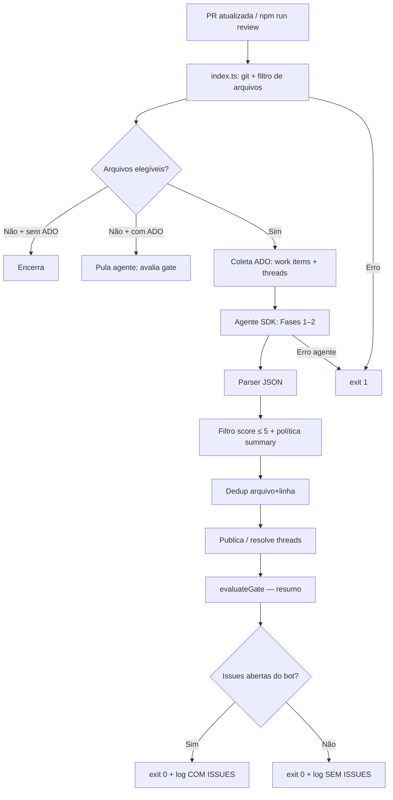
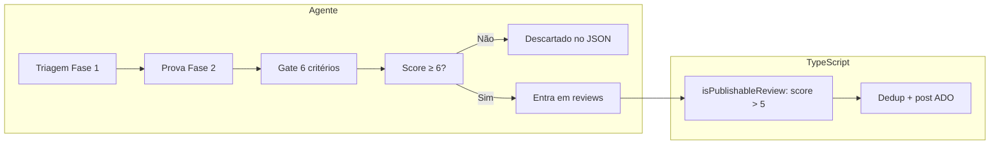

# Fluxo de análise e decisão — Cursor Reviewer

> **Artefato de referência** — descreve o fluxo completo do `cursor-reviewer` desde a preparação do diff até a decisão do que vira thread real na PR.  
> **Última revisão:** jun/2026 (sandbox read-only do SDK, cancelamento real no timeout, resultado canônico via `run.wait()`, logging commands ADO, remoção do campo `urgency`, fence por linguagem em vez de ```suggestion).

---

## Visão geral

O Cursor Reviewer é **review-only**: analisa o diff da PR, publica threads acionáveis no Azure DevOps e **não corrige código**. Correções ficam com o desenvolvedor, que trata as threads diretamente na PR.



---

## Linha do tempo de execução

Ordem exata em `src/index.ts`:

| # | Etapa | Módulo | Quando |
|---|-------|--------|--------|
| 1 | Carregar config (env + CLI + vars ADO implícitas) | `config.ts` | Início |
| 2 | Preparar workspace git (local ou CI) | `git/diff.ts` | Antes do diff |
| 3 | Listar e filtrar arquivos elegíveis | `git/diff.ts` | Antes do agente |
| 4 | Coletar work items + threads ADO | `ado/work-items.ts`, `ado/review-context.ts` | Paralelo, se token + PR |
| 5 | Montar prompt e executar agente | `agent/prompt.ts`, `agent/runner.ts` | Se `fileCount > 0` |
| 6 | Parsear JSON da resposta | `parser/review-response.ts` | Após agente |
| 7 | Aplicar plano de publicação (score, summary) | `ado/post-comments.ts` | Antes de postar |
| 8 | Resolver threads confirmadas → postar novas → summary | `ado/post-comments.ts` | Pipeline (não dry-run) |
| 9 | Resumir issues abertas (exit 0) | `ado/gate.ts` | Final |

---

## Camada 1 — Contexto injetado no prompt (runner)

### Git

- **Range:** `target...HEAD` (local) ou `origin/target...origin/source` (CI).
- **No prompt:** branch source/target, `diffRange`, contagem e lista de paths elegíveis (até 30).
- **Diff embutido:** `buildDiffPromptSection` injeta unified diff (PR pequena) ou por arquivo até ~100 KB; o agente usa na Fase 1 sem depender só de `git diff` via tool.
- **Rules pré-mapeadas:** `buildRulesMap` resolve `.cursor/rules/*.mdc` por glob dos arquivos alterados + `alwaysApply`.
- **Patch completo no log:** resumo por arquivo elegível (nome + tamanho em KB via `getDiffFileSummaries`).
- **Filtro de paths:** `getDiffFileSummaries` / `getDiffPatch` limitam o escopo aos arquivos pós-include/exclude (`buildPathArgs` + `filterFilesByScope`).
- **Diff filter:** `--diff-filter=AMR` (Added, Modified, Renamed) em todos os comandos git diff.

### Arquivos elegíveis e Seleção de Stacks (`config.ts`)

O escopo de arquivos elegíveis para diff/review é determinado pela **stack tecnológica** selecionada via CLI (`--stack`) ou variável de ambiente (`CURSOR_REVIEWER_STACK`). Por padrão, assume a stack `ABP/Angular`.

As stacks disponíveis e seus padrões de inclusão padrão são:

| Stack | includePatterns padrão |
|---|---|
| **ABP/Angular** | `**/*.cs`, `**/*.ts`, `**/*.html`, `*.cs`, `*.ts`, `*.html` |
| **PHP/Laravel** | `**/*.php`, `**/*.js`, `**/*.ts`, `**/*.vue`, `**/*.html`, `**/*.css`, `**/*.json`, `*.php`, `*.js`, `*.ts`, `*.vue`, `*.html`, `*.css`, `*.json` |
| **Next.js/React** | `**/*.ts`, `**/*.tsx`, `**/*.js`, `**/*.jsx`, `**/*.html`, `**/*.css`, `**/*.json`, `*.ts`, `*.tsx`, `*.js`, `*.jsx`, `*.html`, `*.css`, `*.json` |
| **TypeScript** | `**/*.ts`, `**/*.json`, `*.ts`, `*.json` |

O filtro de exclusão (`excludePatterns`) padrão remove proxies, bin/obj, `.md`, `.csproj` e, por padrão, o próprio diretório do runner (`scripts/cursor-reviewer/**`) para evitar self-review indesejado.

Variáveis associadas: `CURSOR_REVIEWER_STACK`, `CURSOR_REVIEWER_REVIEW_SELF`, `CURSOR_REVIEWER_EXTRA_EXCLUDE_PATTERNS`.

### Work items (Azure DevOps)

**Quando:** após o diff, antes do agente, se `org + project + repo + pr-id + token`.

**API:**

1. `GET /pullRequests/{id}/workitems` — IDs linkados à PR.
2. `GET /wit/workitems?ids=...&$expand=all` — detalhes (máx. **10** itens).

**Campos incluídos no prompt:**

- `System.WorkItemType` (User Story, Task, Bug, etc.)
- `System.Title`, `System.State`
- `System.Description` (HTML → texto)
- `Microsoft.VSTS.Common.AcceptanceCriteria` (se existir)

**Não incluído automaticamente:**

- Hierarquia US → tasks filhas (só entra o que estiver **linkado à PR**).
- Descrição/título da PR, commits, planos locais (`.cursor/plans/`).
- Custom fields, tags, sprint, relations.

### Threads existentes do bot

**API:** `GET /pullRequests/{id}/threads`

| Uso | Escopo |
|-----|--------|
| **Dedup** (`existingKeys`) | Threads **active/pending** do bot com `filePath` — chave `path\|line:N` |
| **Prompt LLM (Memória Intra-PR)** | Os sumários de TODAS as threads (ativas e resolvidas) são consolidados na seção `Padrões de Risco Detectados Nesta PR` para orientar ativamente as buscas das Fases 1 e 2. |
| **Prompt LLM (ativas)** | Tabela "Active threads (open)" detalhada (~160 chars) |
| **Prompt LLM (memória fechadas)** | Tabela "Already resolved threads" com instrução de **não re-levantar sem nova evidência** (anti-loop de re-litígio) |
| **Gate** | Threads **active/pending** do bot `[Cursor Reviewer]` apenas |

Threads de humanos **não** entram no prompt; **não** entram no resumo de pendentes do bot. Threads resolvidas **não** entram no `existingKeys` (dedup determinístico) — viram apenas memória para o LLM.

### Instruções fixas e Stack Prompts
- `skills/SYSTEM_PROMPT.md`: modo read-only, contrato JSON, classificação severity/score e filtro de publicação.
- `skills/CODE_REVIEW.md`: roteamento para harness do projeto (skills/rules via tools).
- `skills/stacks/*.md`: arquivo de recomendações específicas para a stack selecionada (injetado dinamicamente).
- `src/agent/prompt.ts`: contexto da execução (incluindo o nome da stack ativa) + **análise em duas fases** (triagem → investigação profunda → veredito JSON).

---

## Camada 2 — Harness do projeto (agente, sob demanda)

Com `settingSources: ['project']` em `agent/stream.ts`:

- `AGENTS.md`, `.cursor/rules/`, `docs/`
- `.agents/skills/code-review/SKILL.md` (obrigatório ler na Fase 0)

O agente **não** recebe o conteúdo desses arquivos no prompt inicial — lê via tools durante a execução.

### Guardrails do SDK (`agent/stream.ts`)

- **Sandbox read-only:** `local.sandboxOptions.enabled` (default `true`; `CURSOR_REVIEWER_SANDBOX=false` só para depuração) restringe escritas ao `cwd` e nega rede — reforço técnico do contrato read-only, além do `SYSTEM_PROMPT.md`. Em ambientes que não suportam o sandbox local do SDK (ex.: agentes hospedados de CI), o `runAgentStream` detecta o erro e reexecuta automaticamente sem sandbox (read-only segue garantido pelo `SYSTEM_PROMPT.md`).
- **Resultado canônico:** o texto final vem de `run.wait()` → `RunResult.result`; o stream acumulado (`fullText`) é apenas fallback.
- **Timeout com cancelamento real:** o SDK não aceita `AbortSignal`; ao estourar `CURSOR_REVIEWER_TIMEOUT_MS`, o runner chama `run.cancel()` (aborta stream + tool calls e faz `wait()` resolver como `cancelled`).

---

## Camada 3 — Investigação runtime (agente)

Instruído a executar na Fase 0/2:

- `git diff {range}` (+ `git diff HEAD` se `--include-uncommitted`)
- Leitura do arquivo alterado inteiro
- Backend: entidade, DTO, AppService, `[Authorize]`, EF, migrations
- Frontend: componente, template, guards, `*abpPermission`, proxies (contrato)
- Testes, chamadores, fluxo ponta a ponta
- `.cursor/rules/` e `docs/` quando arquitetural

Evidência documentada em `analysis` e `impactPaths` na resposta JSON.

---

## Fases do agente (prompt)

`skills/CODE_REVIEW.md` orienta o harness; as **duas fases** (triagem → investigação + classificação) estão detalhadas em `src/agent/prompt.ts`. Contrato e filtro de publicação: `skills/SYSTEM_PROMPT.md`.

### Fase 1 — Triagem conservadora

Candidatos **somente** de linhas alteradas, já incorporando work items e threads do contexto ADO. Descarte imediato: nits, estilo, teoria sem caminho executável, código intocado, HTML cosmético.

### Fase 2 — Investigação analítica + veredito

Por candidato, provar com tools antes de publicar:

1. Evidência lida → `impactPaths`
2. Cenário de falha executável
3. Proteções ausentes (buscadas, não assumidas)
4. Hipóteses descartadas → `analysis`

Sem os 4 itens → **não entra em `reviews`**.

### Fase 3 — Agrupamento e Generalização (Anti Whack-a-mole)

Para cada achado comprovado na Fase 2, varrer (`grep`/`glob`) ocorrências irmãs do mesmo padrão nos arquivos elegíveis e agrupar **todas** no array `relatedOccurrences` — não deixar irmãs para a próxima rodada (evita whack-a-mole). Alinhado ao mandato de **completude na mesma rodada** do `SYSTEM_PROMPT.md` (precisão por achado, recall completo por rodada → convergência em ~1 rodada).

No veredito final reaplica o gate anti-falso-positivo, confirma que percorreu todos os arquivos elegíveis, combina achados na mesma linha e emite **somente** o bloco ` ```json `.

---

## Decisão: issue real vs. ruído

Decisão em **duas camadas** (agente + TypeScript):



### Gate do agente (prompt)

Incluir em `reviews` só se **todas** forem verdadeiras:

1. Evidência verificada por tools
2. Caminho executável em runtime
3. Proteção ausente confirmada
4. Impacto material (segurança, dados, negócio, CI)
5. `fileName` + `lineNumber > 0` na linha alterada responsável
6. Correção proporcional

### Calibração de score (`developerAction`)

| Score | `developerAction` | Publicar? |
|-------|-------------------|-----------|
| 0–2 | `resolve-comment` | **Não** — nit/estilo |
| 3–5 | `resolve-comment` | **Não** |
| 6–8 | `fix-code` | **Sim** |
| 9–10 | `fix-code` | **Sim** — crítico |

> **`resolve-comment`**: classificação de “fechar thread com justificativa, **sem mudar código**”. No reviewer, score ≤ 5 significa **não criar thread**. Se uma thread **for** publicada com `fix-code`, o dev ainda pode tratá-la como falso positivo ao revisar a PR.

### Gate programático (TypeScript)

Em `ado/review-validation.ts` + `ado/post-comments.ts`, `isPublishableReview` exige **todos** os critérios:

Exige **todos**: `score` finito 6–10; `fileName` não vazio; `lineNumber` inteiro > 0; `severity` válida (`critical`/`warning`/`suggestion`); `comment` e `analysis` não vazios; `impactPaths` array não vazio com paths não vazios; `developerAction` ∈ {`fix-code`, `escalate`} (nunca `resolve-comment`). `suggestedFix` é **opcional**.

Reviews fora desse contrato são **descartados** antes da publicação. A filtragem autoritativa roda uma única vez em `parseCodeReviewResponse`; `setPullRequestComments` mantém um filtro defensivo no boundary de POST do ADO. Dupla proteção: prompt + código.

---

## Parser JSON

`parser/review-response.ts`:

- Extrai o **último** fence ` ```json ` válido (ignora fences não-JSON, ex. ` ```ts `).
- Fallback: varre objetos `{...}` de nível superior (chaves balanceadas, O(n)) e usa o **último JSON válido**, preferindo os que têm `"reviews"` (stdout com logs duplicados).
- Sanitização de aspas/quebras se `JSON.parse` falhar; `reviews` não-array lança erro descritivo.
- **Achatamento (Flatten):** Expande os agrupamentos de `relatedOccurrences` gerando múltiplos objetos `CodeReviewItem` separados, preservando a `analysis` mas distribuindo as threads pelos arquivos corretos (anti whack-a-mole).
- Normalização defensiva de `fileName`, `lineNumber`, `impactPaths` e severidade.
- `parseCodeReviewResponse` descarta reviews que não passam em `isPublishableReview` (score 6–10 + campos obrigatórios).

Exit codes:

- **0** — execução concluída (com ou sem issues de review)
- **1** — validação, config, erros ADO/agente ou exceção não tratada

---

## Pós-parse: políticas de publicação

`getCodeReviewPostingPlan`:

| Condição | Comportamento |
|----------|---------------|
| `reviews` + `reviewSummary` juntos | Mantém reviews; limpa summary |
| Reviews com `critical` + summary | Summary ignorado |
| Sem reviews, sem críticos, sem threads pendentes do bot | Publica `reviewSummary` (thread **closed**) |
| Threads pendentes do bot | Não publica summary positivo |

### Dedup

Chave: `caminhoNormalizado|line:N` — não reposta na mesma linha.

### Resolução de threads antigas

Agente retorna `resolvedThreads` com `threadId` ou `fileName`+`lineNumber`. Só resolve quando **verificou** a correção (não porque a linha sumiu do diff). Reply com `<!-- resolution-reply -->` + status `fixed`.

Após resolução, `index.ts` **refresh** das threads pendentes antes de postar novos reviews.

---

## Convergência — orçamento de rodadas (`ado/round-state.ts`)

Garante a terminação do loop `fix-pr ↔ reviewer`:

- **Estado persistido:** thread geral (sem `filePath`) com marcador `<!-- reviewer-round-state -->` e `Rodada: N`. Lida via `parseRoundStateFromThreads` (a partir de `allThreads`), atualizada via PATCH (uma única thread, sem spam).
- **Rodada atual** = rodadas anteriores + 1 (só com contexto ADO).
- **Escalonamento** (`decideRoundEscalation`): quando `currentRound > maxRounds` (`CURSOR_REVIEWER_MAX_ROUNDS`, default 5; `0` desabilita) **e** há reviews novos ou threads pendentes do bot.
- **Em escalonamento:** `splitReviewsForEscalation` mantém só `critical`; warnings/suggestions são suprimidos; `persistRoundState` grava o aviso de **revisão humana recomendada**. Resolução de threads confirmadas segue normal.
- **Persistência:** somente quando a rodada teve issues (`hasOpenIssues || escalate`). Dry-run apenas loga a decisão (sem POST/PATCH).

Complementa o *recall* da rodada 1 (mandato de completude no `SYSTEM_PROMPT.md` + passo 2.5 de generalização por classe): a rodada 1 tende a achar tudo; o orçamento garante que rodadas residuais não gerem apontamentos infinitos.

---

## Resumo do review (não bloqueia pipeline)

`ado/gate.ts` — reporta **COM ISSUES** quando:

1. Qualquer review **novo** seria/foi publicado (após filtros), **ou**
2. Qualquer thread **active/pending** do bot `[Cursor Reviewer]` permanece na PR

**Não bloqueia:** threads de humanos, outros bots, nem a pipeline (sempre exit **0** em execução bem-sucedida).

| Exit | Significado |
|------|-------------|
| 0 | Execução OK (com ou sem issues abertas na PR) |
| 1 | Erro fatal (config, ADO, agente, exceção) |

**Diff vazio + ADO:** agente omitido; resumo ainda lista threads pendentes do bot.

**Dry-run:** simula resolução de threads sem POST real; exit 0 salvo erro.

**Logging commands (Azure Pipelines):** quando `TF_BUILD=true`, `ado/pipeline-logging.ts` emite `##vso[task.logissue]` por achado e `##vso[task.uploadsummary]` com resumo markdown anexado à build. No-op fora da pipeline; não altera o exit code.

---

## Pipeline CI — configuração atual

`azure-pipelines-cursor-code-review.yml`:

- **Zero-config:** step final é apenas `npm run review` — `config.ts` lê vars ADO implícitas (`SYSTEM_*`, `BUILD_*`).
- **Org:** `extractOrgFromCollectionUri` suporta `dev.azure.com/{org}` e legado `{org}.visualstudio.com`.
- **Cache npm:** `Cache@2` + `npm_config_cache`.
- **Checkout:** `fetchDepth: 0` + `persistCredentials: true` para merge-base correto do diff three-dot.

Variáveis lidas automaticamente na pipeline:

| Variável | Uso |
|----------|-----|
| `SYSTEM_PULLREQUEST_SOURCEBRANCH` | Branch source |
| `SYSTEM_PULLREQUEST_TARGETBRANCH` | Target (fallback) |
| `SYSTEM_PULLREQUEST_PULLREQUESTID` | PR ID |
| `SYSTEM_COLLECTIONURI` | Org |
| `SYSTEM_TEAMPROJECT` | Projeto |
| `BUILD_REPOSITORY_NAME` | Repositório |
| `SYSTEM_ACCESSTOKEN` | Publicação ADO |
| `CURSOR_API_KEY` | Agente Cursor |
| `CURSOR_REVIEWER_TARGET_BRANCH` | Target override (variable group) |

CLI `--org`, `--project`, etc. permanecem disponíveis para uso local.

---

## Formato das threads publicadas

```
[Cursor Reviewer]

🛑 **CRITICAL:** Descrição objetiva...

**Correção sugerida:**

```csharp
// patch por linguagem (não ```suggestion — ADO não aplica)
```

<details>
<summary>🔍 Detalhes da Análise IA</summary>

**Score:** 8/10 | **Ação dev:** fix-code

**Análise:**
...

**Caminhos analisados:** /src/Foo.cs, /test/FooTests.cs
</details>
```

Resumo positivo (PR limpa):

```
[Cursor Reviewer]
<!-- review-summary -->

Revisão concluída sem apontamentos. ...
```

---

## Mapa de módulos

```
scripts/cursor-reviewer/
├── src/index.ts              Orquestração + gate
├── src/config.ts             Env, CLI, extractOrgFromCollectionUri, exclude patterns
├── src/agent/
│   ├── prompt.ts             Prompt 2 fases + contexto ADO + schema JSON
│   ├── runner.ts             Agent.create
│   └── stream.ts             Streaming + exit 1 em erro agente
├── src/git/diff.ts           Diff AMR, filtro por arquivos elegíveis
├── src/ado/
│   ├── work-items.ts         Work items linkados à PR
│   ├── review-context.ts     Threads + dedup keys
│   ├── review-validation.ts  Contrato publicável (score, campos obrigatórios)
│   ├── post-comments.ts      Publicação, resolução, reviewSummary
│   ├── pipeline-logging.ts   Logging commands ADO (logissue + uploadsummary)
│   ├── round-state.ts        Orçamento de rodadas + escalonamento (convergência)
│   └── gate.ts               Resumo de issues (exit 0 na pipeline)
├── src/parser/review-response.ts  JSON robusto
└── docs/                     Documentação complementar (este arquivo)
```

---

## Referências externas

| Recurso | Caminho |
|---------|---------|
| Modelo de execução (chamada única vs. multi-agente) | [`two-phase-execution-model.md`](two-phase-execution-model.md) |
| README operacional | [`../README.md`](../README.md) |
| Schema JSON de saída | `skills/SYSTEM_PROMPT.md` (fonte única) |
| Seed / testes E2E | [`../SEED-ISSUES.md`](../SEED-ISSUES.md) |
| Skill code-review | [`.agents/skills/code-review/SKILL.md`](../../../.agents/skills/code-review/SKILL.md) |
| Pipeline YAML | [`azure-pipelines-cursor-code-review.yml`](../../../azure-pipelines-cursor-code-review.yml) |
