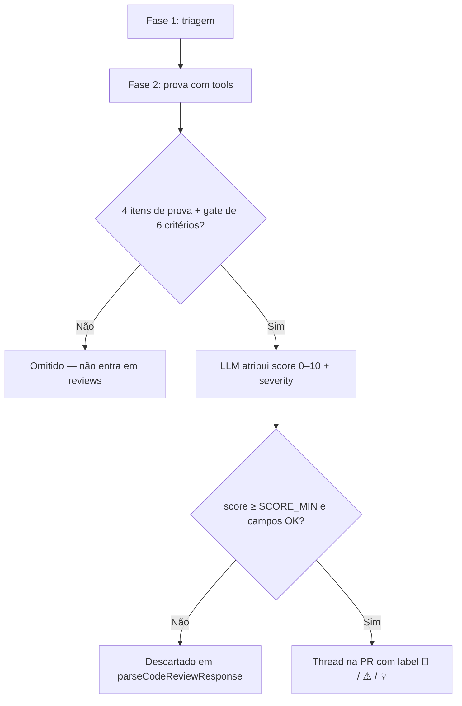

# Score e severidade — Cursor Reviewer

> **Artefato de referência** — descreve como o **score** (0–10) e a **severidade** (`critical` / `warning` / `suggestion`) são atribuídos, validados e usados na publicação de threads na PR.  
> **Complementa:** [`flow-analysis.md`](flow-analysis.md) (fluxo geral) · [`../skills/SYSTEM_PROMPT.md`](../skills/SYSTEM_PROMPT.md) (contrato JSON) · [`.agents/skills/code-review/SKILL.md`](../../../.agents/skills/code-review/SKILL.md) (critérios do projeto).

---

## Visão geral

O Cursor Reviewer **não calcula score por fórmula** (`score = f(linhas, arquivos, …)`). O fluxo é:

1. **Agente LLM** — após provar o achado com tools, **atribui** `score`, `severity` e `developerAction` conforme rubricas dos prompts.
2. **TypeScript** — **valida** se o review é publicável (`isPublishableReview`); descarta score abaixo de `SCORE_MIN` (default **5**) ou contrato inválido.



**Conclusão prática:** o score é uma **calibração qualitativa** do agente, não um número derivado automaticamente do código. O runner garante apenas o **intervalo publicável** (`SCORE_MIN`–10, default **5**–10) e a **integridade do contrato JSON**.

### `SCORE_MIN` (configurável, opt-in)

| Canal | Exemplo | Default se omitido |
|-------|---------|-------------------|
| Env | `SCORE_MIN=4` | `5` |
| CLI | `--score-min 4` | `5` |

**Precedência:** `--score-min` > `SCORE_MIN` > `5`.

**Compatibilidade:** pipelines e invocações existentes que **não** definem `SCORE_MIN` nem `--score-min` mantêm o limiar histórico **5** — sem breaking change. Só defina `SCORE_MIN` quando quiser abaixar (ex.: `4`) ou subir o rigor do que vira thread acionável.

O prompt do agente (`src/agent/prompt.ts`) e o gate TypeScript (`review-validation.ts`) usam o mesmo valor carregado em `config.scoreMin`.

---

## Fontes de verdade

| Camada | Arquivo | Papel |
|--------|---------|-------|
| Contrato da pipeline | `skills/SYSTEM_PROMPT.md` | Tabelas score × severity × `developerAction`; filtro orientativo (gate efetivo: `SCORE_MIN`, default 5) |
| Orquestração do prompt | `src/agent/prompt.ts` | Fases 1–2; instrução de classificar conforme System Prompt; injeta `SCORE_MIN` no filtro |
| Critérios do projeto | `.agents/skills/code-review/SKILL.md` | Brechas, checklist ABP/Angular, calibração 6–8 vs 9–10 |
| Modelo compartilhado | `.agents/skills/fix-pr/SKILL.md` | Escala 0–10 e eixos de julgamento (fix-pr ↔ reviewer) |
| Configuração | `src/config.ts` | `SCORE_MIN` (env) / `--score-min` (CLI); default `5` |
| Gate programático | `src/ado/review-validation.ts` | `DEFAULT_SCORE_MIN = 5`, `MAX_PUBLISHABLE_SCORE = 10`; `isPublishableReview(review, scoreMin)` |
| Parser | `src/parser/review-response.ts` | Normaliza score; severidade inválida → default `warning` |
| Formatação ADO | `src/ado/format-thread.ts` | Prefixo `🛑 CRITICAL` / `⚠️ WARNING` / `💡 SUGGESTION` |
| Escalonamento | `src/ado/round-state.ts` | Após `MAX_ROUNDS`, publica só `critical` |

---

## Pré-requisitos antes de pontuar

Nenhum achado recebe score publicável sem passar pelas etapas abaixo. Se falhar em qualquer uma, o item **não entra** em `reviews` (ou entra com score abaixo de `SCORE_MIN` e é descartado pelo gate).

### Fase 1 — Triagem (descarte imediato)

Descartados **sem pontuação pública**:

- Nits, estilo, preferências estéticas
- Alertas teóricos sem caminho executável em runtime
- Código pré-existente não tocado pelo diff
- Em `*.html`: CSS/Tailwind/layout/grid (salvo segurança, permissões, bindings, validações)

### Fase 2 — Prova obrigatória (4 itens)

Documentados em `analysis` e `impactPaths`. **Todos** obrigatórios:

| # | Item | O que significa |
|---|------|-----------------|
| 1 | **Evidência lida** | Arquivos/símbolos inspecionados via tools |
| 2 | **Cenário de falha executável** | Entrada/estado concreto que dispara o problema |
| 3 | **Proteção ausente** | Testes/validações/invariantes **não** cobrem (cite o que verificou) |
| 4 | **Descartes** | Hipóteses alternativas consideradas e rejeitadas |

Sem os 4 → **não incluir** em `reviews`.

### Gate do agente (6 critérios)

Incluir em `reviews` só se **todas** forem verdadeiras:

1. Evidência verificada por tools
2. Caminho executável em runtime
3. Proteção ausente confirmada (não assumida)
4. Impacto material (segurança, dados, negócio, CI)
5. `fileName` + `lineNumber > 0` na linha alterada mais responsável
6. Correção proporcional (não overengineering)

### Eixos de julgamento (5 perguntas)

Alinhados à skill `fix-pr` e `code-review`:

| # | Pergunta | Efeito típico na nota |
|---|----------|------------------------|
| 1 | O caminho de falha é executável e provável? | Sem isso → omitir ou score abaixo de `SCORE_MIN` |
| 2 | Há coerência com work item / plano da US? | Desalinhamento com AC → sobe (8–9) |
| 3 | Já existe proteção (teste, validação, invariante)? | Se sim → descer ou omitir (≤ 5) |
| 4 | Impacto material (segurança, dados, fiscal, negócio)? | Material + sem proteção → 8–10 |
| 5 | A correção pedida é proporcional? | Nit → 0–5 |

---

## Escala de score (0–10)

O agente usa uma escala **ordinal**. Não há pesos numéricos por dimensão — a nota reflete a **urgência/criticidade integrada** do achado após as provas acima.

### Tabela completa de pontuação

| Score | Faixa | Urgência | Significado | Exemplos típicos | Publicável? |
|-------|-------|----------|-------------|------------------|-------------|
| **0–2** | Descartável | Baixa | Nit, estilo, preferência, cosmético | Formatação, renomeação estética, layout Tailwind sem impacto funcional | **Não** |
| **3–4** | Descartável | Baixa | Risco teórico ou improvável; já coberto | Padrão “poderia ser melhor” sem falha executável; invariante/teste existente cobre o cenário | **Não** |
| **5** | Limiar | Alta (mínima) | Problema real com impacto material, mais localizado | Melhoria com impacto comprovado; edge case específico | **Sim** |
| **6** | Publicável | Alta | Bug leve com impacto funcional secundário | Validação secundária ausente, tratamento incorreto de exceção não crítica | **Sim** |
| **7** | Publicável | Alta | Bug provável ou regressão em cenário concreto | Validação frágil, enum comparado de forma frágil, contrato parcialmente quebrado | **Sim** |
| **8** | Publicável | Alta | Bug provável com impacto claro | `[Authorize]` ausente, `.Result`/`.Wait()` em async, `atob` sem validar base64, `*abpPermission` ausente, N+1 provável | **Sim** |
| **9** | Publicável | Crítica | Falha grave com alto impacto operacional | Regra de negócio invariante violada, perda/corrupção de dados, critério de aceite evidente não implementado | **Sim** |
| **10** | Publicável | Crítica máxima | Exploitável ou bloqueador de merge | DELETE sem auth, XSS (`[innerHTML]`), secrets em código, defaults perigosos em fluxo de escrita (`Guid.Empty`, `DateTime.MinValue`) | **Sim** |

### Referência rápida (fix-pr / code-review)

| Score | Resumo |
|-------|--------|
| 0–2 | Nit / estilo |
| 3–4 | Risco baixo ou warning improvável |
| 5–8 | Bug provável, regressão, contrato quebrado |
| 9–10 | Crítico — segurança, dados, contrato, regra invariante |

---

## Classificação de severidade

A **severidade** (`critical` | `warning` | `suggestion`) é atribuída pelo agente **junto** com o score. Descreve o **tipo de impacto**, não substitui o score.

### Tabela severity × quando usar × score típico

Conforme `skills/SYSTEM_PROMPT.md`:

| **`critical`** | Segurança; perda ou corrupção de dados; quebra de regra de negócio **invariante** | **9–10** | `🛑 **CRITICAL:**` |
| **`warning`** | Bug provável; regressão; contrato quebrado; autorização/permissão ausente | **5–8** | `⚠️ **WARNING:**` |
| **`suggestion`** | Melhoria com impacto material comprovado (**raro** — omitir se for nit) | **5–7** | `💡 **SUGGESTION:**` |

### Regras adicionais por camada

| Contexto | Regra |
|----------|-------|
| **Backend (.cs)** | Defaults perigosos (`Guid.Empty`, `DateTime.MinValue`, `0` quando domínio exige valor) → em geral **`critical`** (score 9–10) |
| **Segurança** | Auth ausente, XSS, injeção, secrets → **`critical`** |
| **Performance** | `.Result`/`.Wait()`, N+1 material → **`warning`** (6–8); corrupção de dados → **`critical`** |
| **Angular (*.html)** | **Nunca** `suggestion` — só `critical` ou `warning` |
| **Work items (prompt legado)** | AC evidente faltando → `critical`; implementação parcial → `warning` |

### Brechas prioritárias (skill code-review)

Mapeamento orientativo severidade ↔ tipo de defeito:

| Tipo de defeito | Severidade usual | Score usual |
|-----------------|------------------|-------------|
| DELETE/mutação sem `[Authorize]` ou permissão ABP | `critical` | 9–10 |
| `[innerHTML]` / XSS | `critical` | 9–10 |
| Violação de invariante de negócio (ex.: delete com referências órfãs) | `critical` | 9–10 |
| `.Result` / `.Wait()` em método async | `warning` | 7–8 |
| `Guid.Empty` / `DateTime.MinValue` não rejeitado | `warning` ou `critical`* | 8–10 |
| Botão destrutivo sem `*abpPermission` | `warning` | 7–8 |
| `atob()` sem validar base64 | `warning` | 7–8 |
| N+1 EF Core material | `warning` | 7–8 |
| Melhoria de clean code com impacto material | `suggestion` | 6–7 |

\* `critical` quando o default inválido pode persistir dados corromidos ou violar regra fiscal/financeira.

---

## Score × severity × developerAction

### Matriz de ações

| Score | `developerAction` | Thread na PR? | Significado para o dev |
|-------|-------------------|---------------|------------------------|
| 0–4 | `resolve-comment` | **Não** | Classificação interna do agente — item descartado pelo gate |
| 5–8 | `fix-code` | **Sim** | Corrigir em código |
| 9–10 | `fix-code` | **Sim** | Corrigir em código (prioridade alta) |
| ≥ 5 + conflito de produto | `escalate` | **Sim** | Decisão humana (WI/plano ambíguos) |

> **`resolve-comment`** no contrato do reviewer significa “não publicar thread”. Reviews novos **nunca** devem usar `resolve-comment` com intenção de publicar — o gate rejeita.

### Relação score ↔ severity (orientação, não regra rígida)

O TypeScript **não** reescreve severity com base no score. A calibração é responsabilidade do agente:

| Combinação esperada | Combinação atípica (aceita se score ≥ SCORE_MIN) |
|---------------------|-------------------------------------------|
| score 9–10 + `critical` | score 9 + `warning` (runner aceita) |
| score 5–8 + `warning` | score 8 + `critical` (runner aceita) |
| score 5–7 + `suggestion` | score 7 + `critical` (runner aceita) |

---

## Gate programático (como o runner “calcula” o que publica)

Implementação em `src/ado/review-validation.ts` + configuração em `src/config.ts`:

```typescript
export const DEFAULT_SCORE_MIN = 5; // usado quando SCORE_MIN / --score-min omitidos
export const MAX_PUBLISHABLE_SCORE = 10;

// isPublishableReview(review, scoreMin = DEFAULT_SCORE_MIN)
```

### Condições para publicação (`isPublishableReview`)

| Campo | Regra |
|-------|-------|
| `score` | Número finito, **SCORE_MIN ≤ score ≤ 10** (default: **5 ≤ score ≤ 10**) |
| `fileName` | Não vazio |
| `lineNumber` | Inteiro **> 0** |
| `severity` | `critical` \| `warning` \| `suggestion` |
| `comment` | Não vazio |
| `analysis` | Não vazio |
| `impactPaths` | Array não vazio; cada path não vazio |
| `developerAction` | `fix-code` \| `escalate` — **nunca** `resolve-comment` |
| `suggestedFix` | Opcional |

Reviews que falham são descartados em `parseCodeReviewResponse` **antes** de POST no ADO. Mensagem típica:

> Policy: N review(s) descartado(s) — score < SCORE_MIN, campos obrigatórios ausentes ou contrato inválido.

(Com o default, equivale a `score < 5`.)

### Normalização no parser

Em `src/parser/review-response.ts`:

- `score` ausente ou não numérico → review **não publicável**
- `severity` inválida → default **`warning`** (mas ainda precisa passar no gate completo)

---

## O que acontece depois da classificação

| Uso | Comportamento |
|-----|---------------|
| **Corpo da thread** | `format-thread.ts` — prefixo por severity + bloco `<details>` com `Score: N/10` |
| **Pipeline Azure DevOps** | `pipeline-logging.ts` — `critical` → `##vso[task.logissue type=error]`; demais → `type=warning` |
| **Resumo positivo** | Se houver review `critical`, `reviewSummary` é **ignorado** |
| **Escalonamento** | `currentRound > CURSOR_REVIEWER_MAX_ROUNDS` (default 10) + issues abertas → publica **só** `critical`; suprime `warning`/`suggestion` novos |
| **Dedup** | Chave `arquivoNormalizado\|line:N` — mesma linha não gera thread duplicada |

---

## Exemplos calibrados (fixtures seed)

Referência: `fixtures/seed/sample-evaluate-output.txt` e `fixtures/seed/expected-scenarios.json` (`minScore: 6` por cenário).

| ID | Defeito | Score | Severity | Justificativa da calibração |
|----|---------|-------|----------|----------------------------|
| SEED-B1 | DELETE sem `[Authorize]` | **9** | `critical` | Operação destrutiva exposta — segurança |
| SEED-B2 | `.Result` em async | **8** | `warning` | Deadlock provável — bug real, não corrupção imediata |
| SEED-B3 | `Guid.Empty` não rejeitado | **8** | `warning` | Default perigoso localizado |
| SEED-F2 | Botão sem `*abpPermission` | **8** | `warning` | Autorização ausente na UI |
| SEED-F3 | `atob` sem validar base64 | **8** | `warning` | Falha em runtime com payload inválido |

---

## Calibração na dúvida

Regras explícitas do `SYSTEM_PROMPT.md`:

| Situação | Comportamento |
|----------|---------------|
| Dúvida se o achado **é real** | **Silêncio** — não publicar |
| Achado **comprovado** que passa no gate | **Publicar** — não omitir para “não poluir” |
| PR sem issues novas | `"reviews": []` + `reviewSummary` positivo (cita título/descrição da **PR**, não de WI/Task) |

Objetivo anti-loop: **completude na mesma rodada** — listar todos os achados materiais de uma vez (score ≥ `SCORE_MIN`, default 5), não reservar para rodadas futuras.

---

## FAQ

### Existe fórmula ou peso por dimensão?

**Não.** Não há soma de pontos por “segurança +2, performance +1”, etc. O agente integra evidência, impacto e probabilidade num único inteiro 0–10.

### O runner corrige score ou severity inconsistentes?

**Não.** Só valida intervalo `SCORE_MIN`–10 (default 5–10) e campos obrigatórios. Severidade inválida vira `warning` no parser; score fora do intervalo descarta o item.

### Posso mudar o limiar sem quebrar pipelines antigas?

**Sim.** `SCORE_MIN` e `--score-min` são **opcionais**. Omitir ambos mantém default **5** — comportamento idêntico às versões anteriores do runner.

### Score 5 vs 8 vs 10 — qual a diferença prática?

| Score | Para o desenvolvedor |
|-------|------------------------|
| 5 | Corrigir — impacto material, menor urgência relativa |
| 8 | Corrigir — bug provável ou falha de contrato clara |
| 10 | Corrigir com prioridade — risco de segurança, dados ou merge blocker |

Todos geram thread; a pipeline **não bloqueia** a build por score (exit 0).

### Por que scores abaixo do mínimo não viram thread?

Com o default `SCORE_MIN=5`, scores 0–4 não publicam — evita ruído (nits, estilo, alertas não comprovados). Ao **abaixar** `SCORE_MIN` (ex.: `4`), issues com score 4 passam a virar thread; ao **omitir** a variável, nada muda em relação ao comportamento histórico.

---

## Referências cruzadas

| Documento | Conteúdo relacionado |
|-----------|------------------------|
| [`flow-analysis.md`](flow-analysis.md) | Gate score, políticas de publicação, escalonamento |
| [`two-phase-execution-model.md`](two-phase-execution-model.md) | Por que classificação roda numa única chamada ao agente |
| [`../README.md`](../README.md) | Formato das threads, JSON de saída, `MAX_ROUNDS` |
| [`../SEED-ISSUES.md`](../SEED-ISSUES.md) | Cenários de teste com `minScore` esperado |
