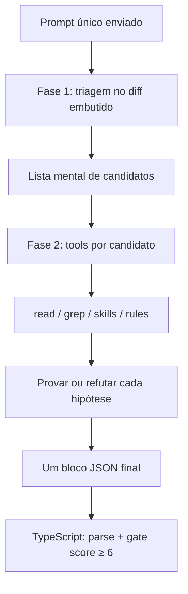

# Modelo de execução — análise em duas fases (chamada única)

> **Artefato de referência** — explica como o cursor-reviewer implementa as duas fases de review (triagem → investigação) e por que optamos por **uma única chamada ao agente** em vez de múltiplos agentes ou steps separados.  
> **Complementa:** [`flow-analysis.md`](flow-analysis.md) (fluxo operacional completo).  
> **Última revisão:** jun/2026.

---

## Resumo executivo

| Pergunta | Resposta |
|----------|----------|
| São dois prompts enviados? | **Não** — um prompt montado por `buildAgentPrompt()`. |
| São duas chamadas ao agente? | **Não** — um `agent.send()` por review. |
| As fases são “mentais”? | **Parcialmente** — Fase 1 é saída mental; Fase 2 usa tools reais na mesma sessão. |
| Quando sai o JSON? | **Uma vez**, no final, após as duas fases. |
| Vale dividir em 2 agentes? | **Não por padrão** — a chamada única é a escolha certa para este caso de uso. |

---

## Como funciona na prática

### 1. Uma montagem, um envio

O `runner.ts` monta o prompt completo e dispara **uma** execução:

```typescript
// src/agent/runner.ts
export async function runCodeReviewAgent(...) {
  const prompt = buildAgentPrompt(config, context);
  return runAgentStream(config, { name: '...', prompt }, logger);
}
```

No SDK, isso vira `Agent.create()` + `agent.send(options.prompt)` — **um run só** (`src/agent/stream.ts`).

O `index.ts` chama `runCodeReviewAgent` **uma vez** por review (ou omite o agente se o diff estiver vazio).

### 2. O prompt já traz as duas fases

`buildAgentPrompt()` concatena tudo num único string:

| Bloco | Origem |
|-------|--------|
| System prompt | `skills/SYSTEM_PROMPT.md` |
| Harness | `skills/CODE_REVIEW.md` |
| Contexto git, diff, rules, ADO | `src/agent/prompt.ts` |
| **Workflow em 2 fases** | `buildTwoPhaseWorkflow()` |
| Veredito final | `buildVerdictAndAdoPolicy()` |

As fases estão descritas em `buildTwoPhaseWorkflow()` (`src/agent/prompt.ts`):

- **Fase 1 — Triagem:** mapa de candidatos ancorados em linhas alteradas; descarte imediato de nits, estilo, teoria sem caminho executável.
- **Saída mental da Fase 1:** lista `(arquivo, linha, hipótese breve)` — **sem JSON intermediário**.
- **Fase 2 — Investigação:** provar ou refutar cada candidato com tools; só os comprovados entram em `reviews`.

Instrução explícita: *"Complete **Fase 1 inteira** antes de iniciar a Fase 2. Não publique achado sem passar pelas duas."*

### 3. O que o agente faz durante o run (mesma sessão)



- **Fase 1:** usa o diff pré-carregado (ou `git diff` via tool) para mapear candidatos nas linhas alteradas.
- **Fase 2:** para cada candidato, usa tools (`read`, `grep`, skill `code-review`, rules do projeto) para provar ou descartar.
- **Saída:** **só no fim** — um bloco ` ```json ` com `reviews`, `resolvedThreads`, `reviewSummary`.

Durante o run aparecem eventos `thinking`, `tool_call` e `assistant` — tudo na mesma conversa.

### 4. Segunda “camada” de fases (não é outro agente)

A doc operacional fala em **decisão em duas camadas**:

1. **Agente (LLM)** — triagem + prova + filtro score ≤ 5 no prompt.
2. **TypeScript** — `isPublishableReview()` descarta o que não passa no contrato antes de postar no ADO.

Isso é pós-processamento determinístico do JSON, **não** uma segunda rodada do LLM. Ver [`flow-analysis.md`](flow-analysis.md) e `src/ado/review-validation.ts`.

---

## Análise: chamada única vs. multi-agente

### Por que a chamada única funciona bem aqui

**1. As fases compartilham o mesmo contexto cognitivo.**

A Fase 2 depende das hipóteses da Fase 1. Num único run, o agente mantém diff, candidatos, rules lidas via tool e raciocínio na **mesma janela de contexto**. Com agentes separados, seria necessário re-serializar a saída da Fase 1 e reconstruir contexto — mais tokens e perda de nuance (“por que achei isso suspeito?”).

**2. As tools já dão o que um “step 2” daria.**

O ganho clássico de multi-step é forçar evidência antes do veredito. A Fase 2 **já é isso**: `read`, `grep`, skill, rules — provar ou refutar cada candidato com os 4 itens obrigatórios documentados em `analysis` e `impactPaths`.

**3. A precisão já tem gate determinístico.**

O filtro final **não é LLM** — é TypeScript (`isPublishableReview`, score 6–10, campos obrigatórios). Isso é mais barato, reprodutível e testável (`npm test`) do que um segundo agente “juiz”.

**4. Custo e latência.**

Um run = um `Agent.create` + `agent.send`. Dois agentes = duas inicializações, dois contextos, mais tempo de parede — relevante numa pipeline de PR a cada push.

### Onde o desenho atual é frágil

| Risco | Sintoma | Mitigação atual |
|-------|---------|-----------------|
| Modelo “pula” a Fase 1 | Achados rasos, `impactPaths` inconsistentes | Instrução explícita + gate exige `impactPaths` não vazio |
| Diluição de instrução (prompt longo) | Ignora regras do meio do prompt | System prompt + skill + fases + ADO num string — **ponto mais frágil** |
| PR grande → atalho | Revisa só alguns arquivos | Nota `PR grande` mandando rodar em todos os arquivos elegíveis |
| Sem checkpoint entre fases | Não dá para inspecionar candidatos da Fase 1 | Fase 1 é “saída mental”, não observável |

O ponto crítico é o **prompt monolítico**: confiabilidade de seguir instruções cai conforme o prompt cresce.

### Quando 2 agentes / múltiplos steps valeriam a pena

Mudar o desenho **somente se** algum destes virar problema **medido**:

1. **Falso positivo persistente apesar do gate** → agente “crítico” separado (generator/critic) que recebe reviews candidatos + diff e só confirma/derruba. Tentar antes endurecer prompt e gate determinístico.

2. **Janela de contexto estourando em PRs grandes** → split natural **por arquivo/chunk**, não por fase: N runs paralelos (um por grupo de arquivos) + agregação. Escala melhor e ainda paraleliza.

3. **Observabilidade dos candidatos da Fase 1** → expor triagem como JSON intermediário (mesmo agente, via `resume`) para debug de por que algo não virou thread.

---

## Recomendações (ordem de custo-benefício)

1. **Barato (manter):** investir no gate determinístico (TypeScript) — precisão garantida sem custo extra de LLM.
2. **Médio:** se PRs grandes forem comuns, **paralelizar por arquivo** (vários runs), não por fase.
3. **Caro / só se necessário:** agente *critic* dedicado apenas para reviews `critical`, como segunda opinião antes de postar.

**Conclusão:** o gargalo de qualidade num reviewer não é “fases demais no mesmo agente”, e sim **evidência + gate**. O desenho atual acerta nisso. Separar em 2 agentes adiciona custo e complexidade de orquestração sem atacar o risco principal (prompt monolítico), que se resolve melhor encurtando/estruturando o prompt e reforçando o gate determinístico.

---

## Mapa de código relacionado

| Módulo | Papel |
|--------|-------|
| `src/agent/prompt.ts` | Monta prompt único; `buildTwoPhaseWorkflow()` |
| `src/agent/runner.ts` | `buildAgentPrompt` + `runAgentStream` |
| `src/agent/stream.ts` | `Agent.create`, `agent.send`, stream, `run.wait()` |
| `src/index.ts` | Orquestração; uma chamada a `runCodeReviewAgent` |
| `src/ado/review-validation.ts` | Gate determinístico pós-LLM |
| `skills/SYSTEM_PROMPT.md` | Contrato JSON e filtro de publicação |
| `docs/flow-analysis.md` | Fluxo operacional completo (contexto ADO, parser, gate, CI) |

---

## Referências

| Recurso | Caminho |
|---------|---------|
| Fluxo operacional | [`flow-analysis.md`](flow-analysis.md) |
| README | [`../README.md`](../README.md) |
| Instruções para agentes | [`../AGENTS.md`](../AGENTS.md) |
